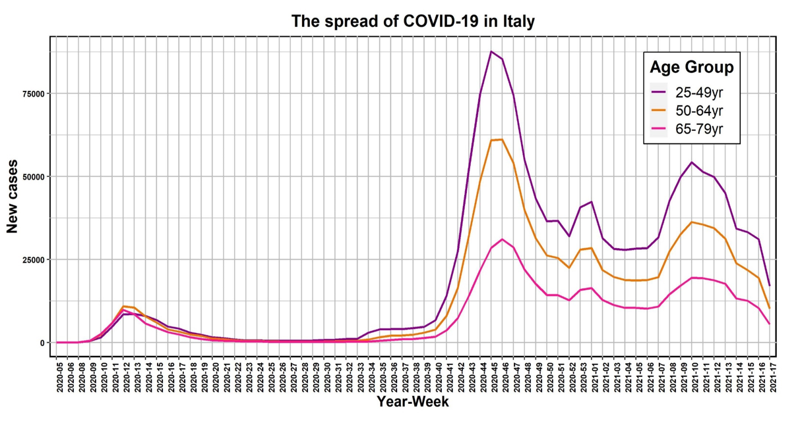

# Analysis-through-the-R-programming-language-of-a-dataset-on-the-diffusion-of-covid-19-in-italy

## Introduction
In this project, the dataset "Data on the 14-day age-specific notification rate of the new COVID-19 cases" found on the European Centre for Disease Prevention and Control website is analyzed using the R programming language. The ultimate goal is to assess the impact of the virus on different age groups of the Italian population, with the intent of identifying, if present, an age range characterized by a higher number of virus-positive individuals than other age groups.

The dataset contains 390 records, 4 fields (listed in the table below), 6 age groups, and 65 observations in each group (age group). The data were collected from week 5 of 2020 to week 17 of 2021. The fields of interest for the purposes of this project are "age_group" and "new_cases," precisely because the objective is to analyze the number of virus positives for each age group.

| Column name |
|-------------|
| country     | 
| year_week   |
| age_group   | 
| new cases   | 

## Exploratory analysis

An important step when faced with a dataset is exploratory analysis. The latter is preliminary to any subsequent insights, and it is useful to understand the data by representing them in various ways. The various representations will then facilitate intuition and interpretation in order to formulate hypotheses that must then be tested using hypothesis testing methods.

The figure below shows the infection trend for each of the age groups described in the legend:

This initial graphical representation of the data suggests a possible significant difference between the "25-49yr", "50-64yr" age groups and the others. This intuition will then have to be rigorously verified with statistical tests, described next.

## Statistical tests and methods used

-  Lilliefors test
-  Shapiro-Wilk test
-  Bartlett test
-  ANOVA
-  Kruskal-Wallis test
-  Bonferroni correction
-  Benjamini-Hochberg procedure

